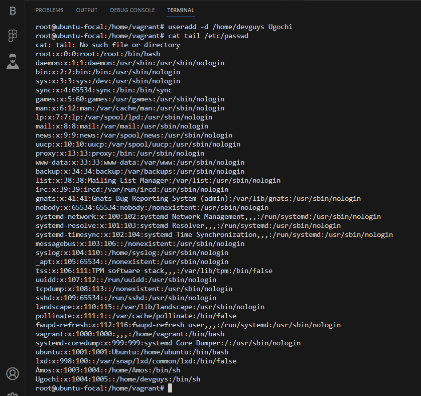

# FIRST ASSIGNMENT

## CREATE A USER
Command `useradd`  was created

Command `cat /etc/passwd` was used to check if the user is listed in the directory.

## SET AN EXPIRY DATE OF 2 WEEKS FOR THE USER

Command `usermod -e YYYY-MM-DD` was used to set an expiry date for the user

## PROMPT THE USER TO CHANGE THEIR PASSWORD ON LOGIN

### The first step is to create password for the user
Command `passwd` was used to create a password for Ugochi

### The next step is to force the password to expire
Command `passwd -e <username>` was used to expire the password so that the user can change the password in the next login.

### Check if it has expierd
We will need to enter as user Ugochi using Command `su Ugochi`

## ATTACH THE USER TO A GROUP CALLED ALTSCHOOL
I have a group called altschool so for the purpose of this assignment I named my group "altschool1"

### The first step is to create a group
Command `groupadd` was used to create a group

### The second step was to append the user Ugochi to the group altschool1

Command `usermod -a -G <groupname> <username>`

Command `cat /etc/group` was used to see if the group was created

## ALLOW ALTSCHOOL1 GROUP TO BE ABLE TO RUN ONLY CAT COMMAND
Command `vi sudo` was used to open the sudo file to imput the configurations 

##  CREATE ANOTHER USER AND MAKE SURE THE USER IS NOT IN THE HOME DIRECTORY
Another user called amos was created

Command `useradd -M <username>` was used to create the user

Command `cat /etc/passwd` was used to check if the user was created

Command `ls -l <username>` was used to check if it was in the home directory

